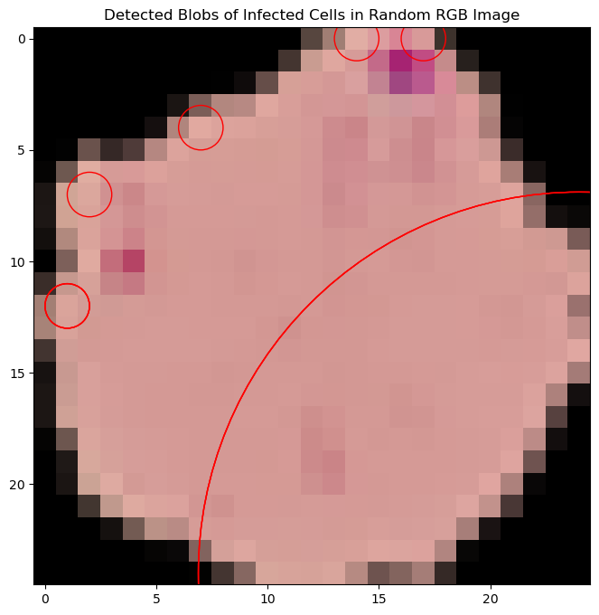
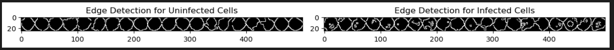

# Machine Learning Modelling on Malaria Cell Image Recognition
](Dataset/science.jpg)

The primary aim of the project is to analyze cell image data of subjects that have malaria and subjects that do not have malaria and apply machine learning principles which will allow the machine to predict whether or not a subject has malaria. This can assist healthcare practitioners on easier metrics in terms of diagnosis, as well as the general public. This can allow the general public to possibly seek out further medical assistance if they believe they may have malaria.

## Our team:
* [Julia Liou](https://github.com/jnliou) 
* [Kevin Wan](https://github.com/zRandgris) 
* [Manpreet Sharma](https://github.com/mehpree)
* [Srinivas Jayaram](https://github.com/srinivasj1987) 

## Programs Utilized:

### Backend 
* Python: Matplotlib, Numpy, Pandas, Scipy.stats, Sklearn, Tensorflow, PIL, OS, CV2, boto3, Keras, Shutil, IO, Random 
* Flask
* SQLite
* S3.Bucket
* CSV Files

### Frontend
* HTML/CSS: Jinga2, Bootstrap
* Javascript: Plotly
* Sweetalert2
 
### Other
* GitHub
* Tableau
* Canva
* Miro
* Trello

## Dataset used:
* [Kaggle Dataset on Malaria](https://www.kaggle.com/datasets/iarunava/cell-images-for-detecting-malaria) 
* [Originally from National Library of Medicine](https://lhncbc.nlm.nih.gov/LHC-downloads/downloads.html#malaria-datasets)

## To run the web app:

* Contact [Kevin Wan](https://github.com/zRandgris) for the config.py that goes with the webapp. 
* Git clone- https://github.com/jnliou/project4.git 
* cd into directory- project4/Project lab
* Start Flask app with [app.py](Project lab/app.py) by writing ```python app.py``` in terminal. 
* This will be able to run the web app. 


## Project Management:

* [Project Management](https://trello.com/b/ZZba331m/project-4) 
* [Diagram](https://miro.com/app/board/uXjVMgjTsg0=/?share_link_id=996896602000)

## Data Cleaning and Exploratory Data Analysis

### Data Preprocessing 
* [Kaggle Dataset on Malaria](https://www.kaggle.com/datasets/iarunava/cell-images-for-detecting-malaria) 
* [Jupyter Notebook Code for Data Preprocessing](<data_preprocess.ipynb>)

#### Instructions on how to run the code

- As the dataset was >100mb we were unable to upload it onto GitHub even after compressing the folder into a ZIP format.
- In order to access the original dataset, please download it from Kaggle: [Kaggle Dataset on Malaria](https://www.kaggle.com/datasets/iarunava/cell-images-for-detecting-malaria).
- Extract the folder into the ```Dataset``` folder.
- Run the code via [Jupyter Notebook Code for Data Preprocessing](<data_preprocess.ipynb>) 

#### Notes on the Data Cleaning/Preprocessing Process
* The original dataset contained 3 folders, one named ```cell_images\cell_images```, one named ```cell_images\Uninfected```, and one named ```cell_images\Parasitized```. As the ```cell_images\cell_images``` folder contained the same data as the Uninfected and Parasitized folders, this folder was deleted to assist with easier processing of the data. 
*  We then converted the photos into 25x25 pixels.
* Utilizing Jupyter Notebook and Python we selected 2500 photos from ```Dataset\cell_images\Parasitized``` and 2500 photos from ```Dataset\cell_images\Uninfected``` and added 1750 infected photos into ```cell_images\clean\train\infected_processed``` and   1750 uninfected photos to ```cell_images\clean\train\uninfected_processed``` for training data, and 750 infected photos into ```cell_images\clean\test\infected_processed``` and 750 uninfected photos into ```cell_images\clean\test\uninfected_processed``` for testing data. This cut down our photos from **27,558** to **5,000**. 

From  to .

## Exploratory Data Analysis


Tableau Dashboard of Exploratory Data Analysis: https://public.tableau.com/app/profile/julia.liou6123/viz/EDAonCellImagesofMalaria-Tableau/RGB 
* [Jupyter Notebook Code for EDA](<EDA.ipynb>) 

### Cell Image Analysis

This repository contains an analysis of cell images comparing unprocessed vs. processed and uninfected vs. infected cells. Various image analysis techniques, including blob detection, edge detection, edge density, and RGB color channel distribution, were utilized to determine differences in characteristics or properties between the two.


### Blob Detection Analysis

### Mean Blob Size and Max Blob Size


Blob detection was performed to identify and analyze blobs within the images. For both uninfected and infected cells, the mean blob size and the maximum blob size were calculated. Statistical differences were assessed using histograms and T-tests.

### Edge Detection Analysis

Edge detection was employed to visualize the differences between uninfected and infected cells in terms of their edge structures. The resulting images provide a clear visual representation of the variations in edges.

](Dataset/EDA/edgedetection.PNG)

### Edge Density Analysis

Edge density comparison between uninfected and infected cells was conducted. Histograms and T-tests were used to analyze the differences in edge density characteristics.

### Average RGB Color Analysis

The average RGB color distribution of each image for infected and uninfected cells was compared. Histograms and T-tests were used to evaluate any statistical distinctions in average RGB color distribution.

## Principal Component Analysis

We used two methods to perform PCA on our image dataset. 

- Approach1: Performing PCA over Image Characteristics and Features as mentioned below. Results are displayed as below. 
    - RGB Channel Distribution
    - Max/Mean Blob 
    - Edge Density of the image
 


- Approach2: We performed PCA on our raw image dataset by following the steps below to see if there is a split between class labels.
    - Read images
    - Flatten images
    - Process in PCA
    - Plot on 2d map, color by class label


### Data Integration and Export

The results of the various analyses were integrated into 4 DataFrames. 2 for the training data: ```Dataset/eda_train_infect.csv```, ```Dataset/eda_train_uninfect.csv```, and two for the testing data: ```Dataset/eda_test_infect.csv```, ```Dataset/eda_test_uninfect.csv``` for further analysis and reference.

**Data Transformation**
After cleaning, we transformed the data to make it suitable for our analysis and Machine Learning purposes. This involved the following:
WRITE HERE 

**Data Integration**
Once we had consistent structures of data, we integrated it into a single DataFrame using SQLite.

**Step 6: Data Export**
Data was exported to our website using a SQLite database which consisted of the predictions from our ML model, while our raw data (image dataset) was hosted on S3 bucket. 

**Step 7: Building the Machine Learning**
We tried a few different machine learning models to figure out the best accuracy for our end goal. 

### Machine Learning Models:

| EDA |                                    | IMAGE |
| Model                        | Accuracy || Model || Accuracy |
|------------------------------|----------||--------|----------|
| Random Forest (RF)           | 83%      || CNN    | 0.83     |
| Random Forest + hyperparameter| 89%     || KNN    | 0.6      |
| RF + Gradient Boosting       | 83%      |
| Linear Regression Model      | 32%      |
| SVC Model                    | 79%      |
| SVC+Hyp                      | 85%      |
| SVC + PCA                    | 79%      |
| SVC+RF+NN                    | 81%      |
| Decision Tree                | 0.74     |


**A) CNN (Convolutional Neural Network):**

The CNN model was designed for the classification of cell images into two categories: uninfected (0) and infected (1). It's aimed at assisting in the automated detection of infected cells, a task of significance in the detection of Malaria.

- **Training Dataset:**
  - Dataset Size: 1750 cell images.
  - Features: Each row in the dataset represents an image, with each pixel of the image treated as a feature.
  - Target Variable: The "Target" column indicates the class label, where 0 represents uninfected cells, and 1 represents infected cells.

- **Data Preprocessing:**
  - Image Resizing: All images were resized to a consistent size (not specified in the provided information) to ensure uniform input dimensions for the CNN.
  - Normalization: Pixel values were scaled to a range of [0, 1] by dividing by the maximum pixel value (e.g., 255 for 8-bit images). This standardization helps improve convergence during training.

- **Model Architecture:**
  - The CNN model architecture used for cell image classification is as follows:
    - Input Layer: Accepts images with dimensions (32, 25, 25, 3)
    - Convolutional Layers: Three convolutional layers were employed with varying numbers of filters and filter sizes.
    - Max-Pooling Layers: Max-pooling layers followed each convolutional layer to reduce spatial dimensions.
    - Flatten Layer: The output from the final max-pooling layer was flattened into a 1D vector of length 16.
    - Dense Layers: Two dense (fully connected) layers were used.
    - Dropout Layer: A dropout layer with a dropout rate of 0.5 was added after the first dense layer to prevent overfitting.

- **Model Training:**
  - Loss Function: Binary cross-entropy.
  - Optimizer: Adam
  - Batch Size: 32
  - Epochs: 50
  - Validation Split: 20% of the training data was used for validation during training to monitor model performance.

- **Model Evaluation:**
  - The model's performance was evaluated using common binary classification metrics, including:
    - Accuracy: Measures the overall correctness of predictions. For this model, the accuracy was 94%.

**B) Random Forest:**

The EDA data was analyzed by a Random Forest model to predict if a cell was infected or not. The Random Forest model was tuned with hyperparameters, and the important features were identified.

- **Testing Data:**
  - The testing dataset of 750 images that were not seen by the model was used to test the dataset. The model was used to predict infected and uninfected cells.

- **Results:**
  - The Random forest with hyperparameter tuning gave an accuracy of 89%.

**C) Ensemble:**

Since the two models are determining whether the cells are infected or not, the predictions from these two models were pooled in a 60/40 ratio of CNN predictions and Random Forest predictions.

**D) Xception:**

This is a pre-trained model on the popular image dataset called `imagenet`. We built our base model using the pre-trained model and then added a layer of our own testing and training dataset to see how it will perform. We got an accuracy of 79% over 20 epochs.

These machine learning models were used to classify cell images into infected and uninfected categories for the Malaria detection task.

The graphs below depict that the data was overfitting at certain points.


## FLASK
### Key Libraries Used:

| Type | Library|
|-----:|---------------|
| Data Handling & Processing|   Numpy, Pandas |
| Web Framework |  Flask  |
| Storage & AWS Interaction|  Boto3   |
|  File Handling & Compression|  Zipfile, IO   |
| Randomization| Random  |
|  Database & ORM| SQLAlchemy, csv  |

### Backend Processes & AWS Integration:
* To interact with our AWS storage, we generated pre-signed URLs from our S3 bucket name and key. This provides an API for Flask to retrieve image files.
 * The essential aws_access_key is fetched from our config file, ensuring its security by not sharing it on GitHub.
### User Interaction & Data Handling:
* Flask plays a pivotal role in capturing user input data from our web game, which is temporarily stored in a global variable.
* After processing this data through our game logic, Jinja2 templating assists in parsing the variables to the frontend, making it accessible for various functions.
### API Creation:
* With the combination of SQLAlchemy and Flask, we've set up API routes that output data in JSON format.
  
**These intricacies, woven together, create a robust and interactive platform tailored to our users' needs.**

* Codes found here for helping to run Flask: [helper.py](helper.py)
* To run Flask: [app.py](app.py)
* SQLite Database: [WRITEHERE.db](project3.db)
* Queries on SQLite to create tables: [SQLite-query](sqlite-query)

## Front End Development for User Integration
Pluggin used includes plotly, bootstrap and google fonts.

### Front-end: 
* HTML and CSS have been employed to design the visuals and effects. For user interactions, including an engaging game to showcase our machine learning model, we've used JavaScript.
### Visualization: 
* Plotly was instrumental in creating graphical representations like pie charts.
### Styling & Fonts: 
* Bootstrap and Google Fonts enhanced the website's aesthetics and readability.
### Backend & Storage:
* With Flask serving as our backend framework, we're efficiently reading data from our database.
* AWS S3 has been our choice for storage. It allows us to select image names from the database and subsequently extract and display the relevant image files on the website.
### User Interaction: 
* Users can select infected cells on the platform. Once they submit their selections, the data is sent to our backend for processing.
**By seamlessly integrating these tools, we've been able to craft a dynamic and interactive platform for our users.**
 

  


##### Presentation

  [Presentation Slides](https://www.canva.com/design/DAFwuowNvz0/wqoWiCOmdgKINQC8cjHQyQ/view?utm_content=DAFwuowNvz0&utm_campaign=designshare&utm_medium=link&utm_source=publishsharelink)

