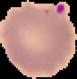
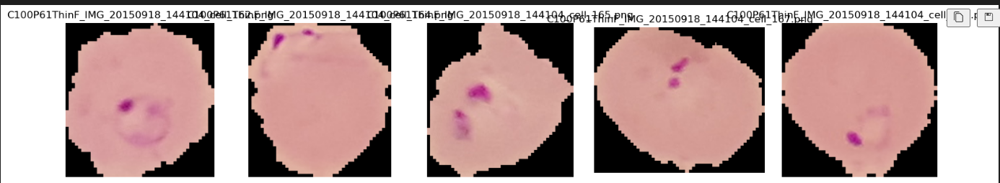
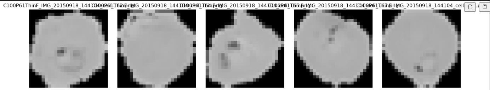

# Machine Learning Modelling on Malaria Cell Image Recognition
](Dataset/science.jpg)

The primary aim of the project is to analyze cell image data of subjects that have malaria and subjects that do not have malaria and apply machine learning principles which will allow the machine to predict whether or not a subject has malaria. This can assist healthcare practitioners on easier metrics in terms of diagnosis, as well as the general public. This can allow the general public to possibly seek out further medical assistance if they believe they may have malaria.

## Our team:
* [Julia Liou](https://github.com/jnliou) 
* [Kevin Wan](https://github.com/zRandgris) 
* [Manpreet Sharma](https://github.com/mehpree)
* [Srinivas Jayaram](https://github.com/srinivasj1987) 

## Programs Utilized:

### Backend 
* Python: pil, shutil, random
* Flask
* SQLite

### Frontend
 
### Other
* GitHub

## Dataset used:
* [Kaggle Dataset on Malaria](https://www.kaggle.com/datasets/iarunava/cell-images-for-detecting-malaria) 
* [Originally from National Library of Medicine](https://lhncbc.nlm.nih.gov/LHC-downloads/downloads.html#malaria-datasets)

## To run the app:

* Git clone- https://github.com/jnliou/project4.git 
* cd into directory- project4 
* Start Flask app with [app.py](app.py)
* Run [index.html](index.html) to view the dashboard in a browser


## Data Cleaning and Exploratory Data Analysis

### Data Preprocessing 
* [Kaggle Dataset on Malaria](https://www.kaggle.com/datasets/iarunava/cell-images-for-detecting-malaria) 
* [Jupyter Notebook Code for Data Preprocessing](<data_preprocess.ipynb>)

#### Instructions on how to run the code

- As the dataset was >100mb we were unable to upload it onto GitHub even after compressing the folder into a ZIP format.
- In order to access the original dataset, please download it from Kaggle: [Kaggle Dataset on Malaria](https://www.kaggle.com/datasets/iarunava/cell-images-for-detecting-malaria).
- Extract the folder into the ```Dataset``` folder.
- Run the code via [Jupyter Notebook Code for Data Preprocessing](<data_preprocess.ipynb>) 

#### Notes on the Data Cleaning/Preprocessing Process
* The original dataset contained 3 folders, one named ```cell_images\cell_images```, one named ```cell_images\Uninfected```, and one named ```cell_images\Parasitized```. As the ```cell_images\cell_images``` folder contained the same data as the Uninfected and Parasitized folders, this folder was deleted to assist with easier processing of the data. 
* Utilizing Jupyter Notebook and Python we randomly selected 500 photos from ```Dataset\cell_images\Parasitized``` and 500 photos from ```Dataset\cell_images\Uninfected``` and added the photos into a [new folder](Dataset/clean) with Parasitized Cells being in a folder called [output_parasitized](Dataset/clean/output_parasitized) and the Uninfected Cells being in a folder called [Dataset/clean/output_uninfected](Dataset/clean/output_uninfected). This cut down our photos from **27,558** to **5,000**. 


* From the randomized photos, we then converted the photos into 25x25 pixels. The processed photos were added into two folders, with Parasitized Cells being in a folder called [test](Dataset/clean/output_parasitized_process) and the Uninfected Cells being in a folder called [train](Dataset/clean/output_uninfected_process).

From  to 

## Exploratory Data Analysis

Tableau Dashboard of Exploratory Data Analysis: https://public.tableau.com/app/profile/julia.liou6123/viz/EDAonCellImagesofMalaria-Tableau/RGB 

### Cell Image Analysis

This repository contains an analysis of cell images comparing unprocessed vs. processed and uninfected vs. infected cells. Various image analysis techniques, including blob detection, edge detection, edge density, and average color comparison, were utilized to determine differences in characteristics or properties between the two.




### Blob Detection Analysis

### Mean Blob Size and Max Blob Size

Blob detection was performed to identify and analyze blobs within the images. For both uninfected and infected cells, the mean blob size and the maximum blob size were calculated. Statistical differences were assessed using histograms and T-tests.

### Edge Detection Analysis

Edge detection was employed to visualize the differences between uninfected and infected cells in terms of their edge structures. The resulting images provide a clear visual representation of the variations in edges.


### Edge Density Analysis

Edge density comparison between uninfected and infected cells was conducted. Histograms and T-tests were used to analyze the differences in edge density characteristics.

### Average Color Analysis

The average color of each image for infected and uninfected cells was compared. Histograms and T-tests were used to evaluate any statistical distinctions in average color properties.

### Data Integration and Export

The results of the various analyses were integrated into a single DataFrame. This DataFrame was saved as a CSV file named `eda.csv` for further analysis and reference.

**Data Transformation**
After cleaning, we transformed the data to make it suitable for our analysis and Machine Learning purposes. This involved the following:
WRITE HERE 

**Data Integration**
Once we had consistent structures of data, we integrated it into a single DataFrame using SQLite.

**Step 6: Data Export**


## FLASK 

We utilized SQLAlchemy and Flask to create API routes in JSON format for 

* Codes found here for helping to run Flask: [helper.py](helper.py)
* To run Flask: [app.py](app.py)
* SQLite Database: [WRITEHERE.db](project3.db)
* Queries on SQLite to create tables: [SQLite-query](sqlite-query)

## Data Science

## Front End Development for User Integration


##### Presentation

